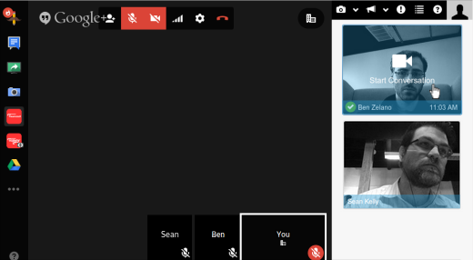

# Teamout

Google Hangouts for Teams: "always-on" video conferencing for remote teams



## Features

### Webcam snapshots

The app will periodically turn on the webcam, take a quick snapshot, and share
it with the rest of the users in the room.  This allows users to quickly see
if someones around before they attempt to start a video conversation.

The webcam used for snapshots can be configured as well as the frequency with
which snapshots are taken.

### Privacy

We know privacy is important.  For that reason, you can choose to blur or
pixelate the snapshots taken from your webcam.  In addition, you can choose to
enable face-detection only -- will only be notified as to whether you're in the
view of the webcam or not.

In addition, you can enable a "busy" mode.  This will notify other users in the
room that you consider yourself busy.  If a user attempts to start a conversation
with you when you're in "busy" mode, you'll be able to hear and see them.
However, they will not be able to hear or see you.  As a result, you can choose
to ignore the user -- or decide to turn on your mic / video if you deem the
conversation critical enough.

### Notifications

Various notifications are used throughout the app for alerting when a new
conversation is started or browser permissions need to be enabled.  The app
supports both desktop and audio notifications -- both of which can be turned
on / off.

### Room Directory

In many companies, you're likely to have multiple teams which will want their
own room.  The app supports this via a room directory.  This directory contains
all known rooms that users have created.  You can choose to create your own
room or hide ones you're not interested in.  Clicking on a room will navigate
away from the current page and join a new Hangout for that room.

### Browser support

The app supports the same browsers that Google Hangouts supports.  However, some
features will be disabled dependency on the browser.  For example, webcam snapshots
are only supported in Firefox and Chrome.

One important note: if using Firefox, you will need to change the `media.navigator.permission.disabled`
configuration value to `true` via the `about:config` page.  This is necessary
until the next major release of Firefox.

## Directory structure

Application logic:
* `app/main.js` - Entry point for the application
* `app/main.xml` - Google gadget configuration
* `app/assets/` - Audio, CSS, Fonts, Images
* `app/collections/` - Backbone collection instances
* `app/lib/` - Abstract / general libraries used within application logic
* `app/models/` - Backbone model instances
* `app/views/` - Ractive view logic

Vendor logic:
* `bower.json` - Third-party components used within the app
* `package.json` - Node.js modules used for packaging
* `node_modules/` - Installed Node.js modules
* `vendor/` - Installed bower components

Configuration:
* `Makefile` - Tasks for building / deploying the app
* `config/webpack.js` - Webpack configuration for building the app
* `config/webpack-records.json` - A *generated* list of build files from Webpack

## Setup

Install:

```
sudo apt-get install rpm
npm install
bower install
```

Run:

```
./bin/teamout
```

Load:

```
http://localhost:3000/
```

## Deployment

### Commands

The following build commands are most typically used:

`make clean` - Cleans out the `public/` release directory

`make all` - Builds / packages the application into the `public/` directory

`make deploy` - Uploads whatever is in `public/` to S3

You can control various parts of the build process with the following environment
variables:
* `DIST` - The release directory that the packaged app is copied into (default: `public/`)
* `JS_COMPRESSOR` - Path to the binary for JS compression (defaults: npm-installed uglifyjs)
* `CSS_COMPRESSOR` - Path to the binary for CSS compression (default: npm-installed cleancss)
* `WEBPACK` - Path to the binary for Webpack (default: npm-installed webpack)
* `S3_BUCKET` - The name of the S3 bucket to upload the app to (default: `teamout`)
* `TARGET` - The environment which the build is for.  `production` environments will cause
  the js / css to be minified / versioned and cleans out the `DIST` directory.  (default: `development`)

### Development

To deploy the application for development:

```
make all
```

This will build the app at `public/development/` and expect the app to be loaded
at `//localhost:3000/development/`.  Simply upload `public/development/main.xml`
to a publicly available location and configure the Google Gadget XML file as
`http://my.location/development/main.xml`.

Note that Google Hangouts runs in `https` -- and therefore your local environment
must also support that protocol.

### Production

To deploy the application in production:

```
TARGET=production make all deploy
```

This will build the application and upload it to S3.

## Integration

Once your app has been deployed, the next step is setting up a new Google Hangouts
Widget.  To do so, walk through the following steps:

1. **Go to the Google Developers Console**.  Visit https://console.developers.google.com.
2. **Create a new project**.  Click "Create Project".  You should be automatically
   taken to the project page.  If not, select it from the list in the Console.
3. **Enable the Hangouts API**.  Expand the "APIs & Auth" menu on the left and click "APIs".
   Scroll until you see "Google+ Hangouts API" and click the "OFF" button -- this will turn
   it on.
4. **Edit the Hangouts API settings**. Click the cog icon next to "Google+ Hangouts API".
   Use the following settings:

   Application URL: http://path/to/main.xml

   Application Type: Extension

   Additional OAuth Scopes: Unchecked

   Locale: Default

   Title: Team Hangouts

   16x16 Icon: http://path/to/assets/images/logo-16.png

   32x32 Icon: http://path/to/assets/images/logo-32.png

   220x140 Icon: http://path/to/assets/images/logo-200.png

   Terms of Service: http://yourcompany.com/tos

   Privacy Policy: http://yourcompany.com/privacy

   Support Contact Information: http://yourcompany.com/support

   Make Public: Unchecked
5. **Save setting**. Click "Save" at the bottom of the page.
6. **Launch a Hangout**.  Click the "Enter a hangout" link below the "Save" button.

## Contributing

See the CONTRIBUTING.md documentation for more information on contributing to
this project.